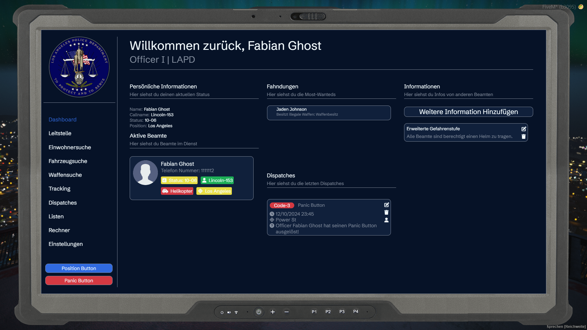

# f_mdt
FiveM MDT &amp; CAD System

## ⚠️ Achtung dieses Script kann noch Bugs verursachen und ist noch nicht zu 100% fertiggestellt!




## Installation
 - SQL einfügen
 - imgbb Token erstellen und einfügen
 - Outfit Template URL einfügen

## Exports
| Export             | Beschreibung |
| ----------------- | ------------------------------------------------------------------ | 
| exports[“f_mdt“]:setFlightMode(bool) | Setzt den Flugmodus damit der Spieler nicht mehr getrackt werden kann |
| exports[“f_mdt“]:getFlightMode() | Returnt den Flugmodus des Spielers |
| exports[“f_mdt“]:addDisatch(string(code, string, string, vector3) | Erstellt einen Dispatch |
| exports[“f_mdt“]:openMDT() | Öffnet das MDT (Jobs Checks werden nicht umgangen) |

## Inventory Item
```
["police_tablet"] = {
    label = "MDT",
    weight = 800,
    client = {
        export = "f_mdt.useTablet"
    }
},
```


